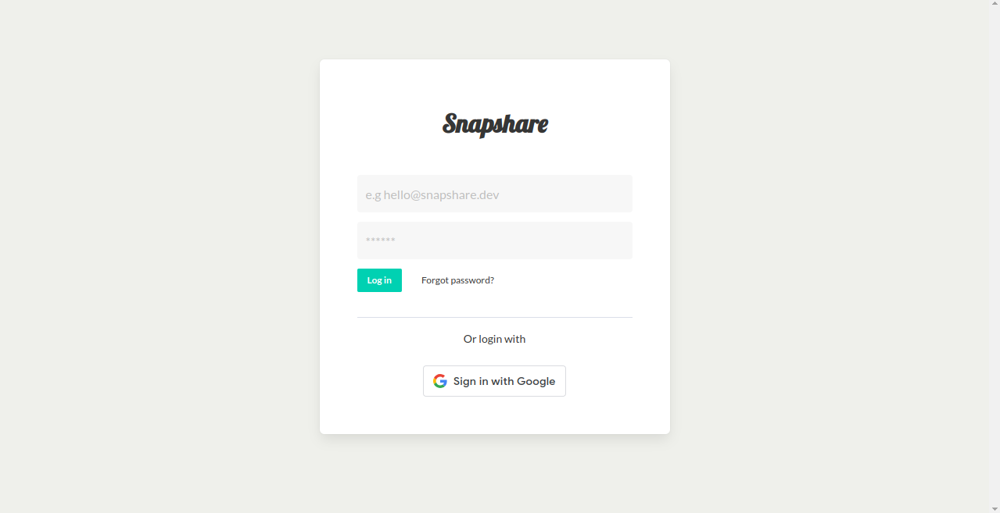

# SnapShare

Capture and Share Memories with SnapShare: A Photo Sharing FullStack Application for Everyone.

## Screenshot

## Web version

- Visit [here](https://snapshare-sm.vercel.app/)

### Built with

- HTML
- SCSS
- Bulma CSS
- React JS
- JavaScript
- Sanity (Backend)

### Getting Started with scaffolding this Project

This project was bootstrapped with [Vite](https://github.com/vitejs/vite).

## Learn More

You can learn more in the [Vite documentation](https://vitejs.dev/guide/).

To learn React, check out the [React documentation](https://reactjs.org/).

Learn more about Sanity, check out the [Sanity docs](https://www.sanity.io/docs/introduction/getting-started?utm_source=readme).
